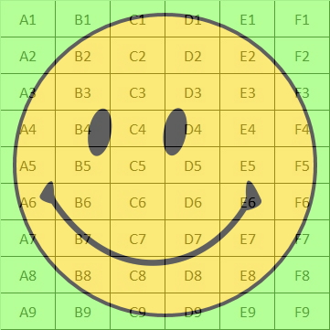
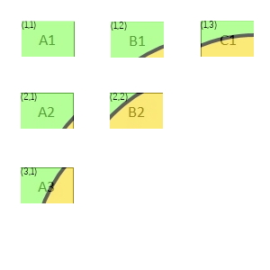

# Make Jumbo Poster from Small Photos Assembled Together

Printing a poster-sized photo is expensive. Printing standard photos (4x6) is cheap.

This Python 3 script takes any photo and breaks it out into small pieces that can then be printed as standard 4x6 prints. Those 4x6 prints can then be glued or taped together to create a large poster.

The script handles scaling. It also includes an address tag on each image (like "(1,1)") to make it easy to later know where each 4x6 photo needs to fit back into the poster.

NOTE: many print services automatically apply colour corrections to the prints. Given that each photo here is really just a small piece of a larger photo, colour correcting can give some "funny" results and make the final assembled poster look bad. It is best make any photo corrections on the original photos (before splitting it here), and then disable colour corrections from the print service.

## Start with some photo

## 2. The script splits it up into a series of standard photo-size images

## 3. Tape the collection of photos onto some backing board and enjoy your large poster!
